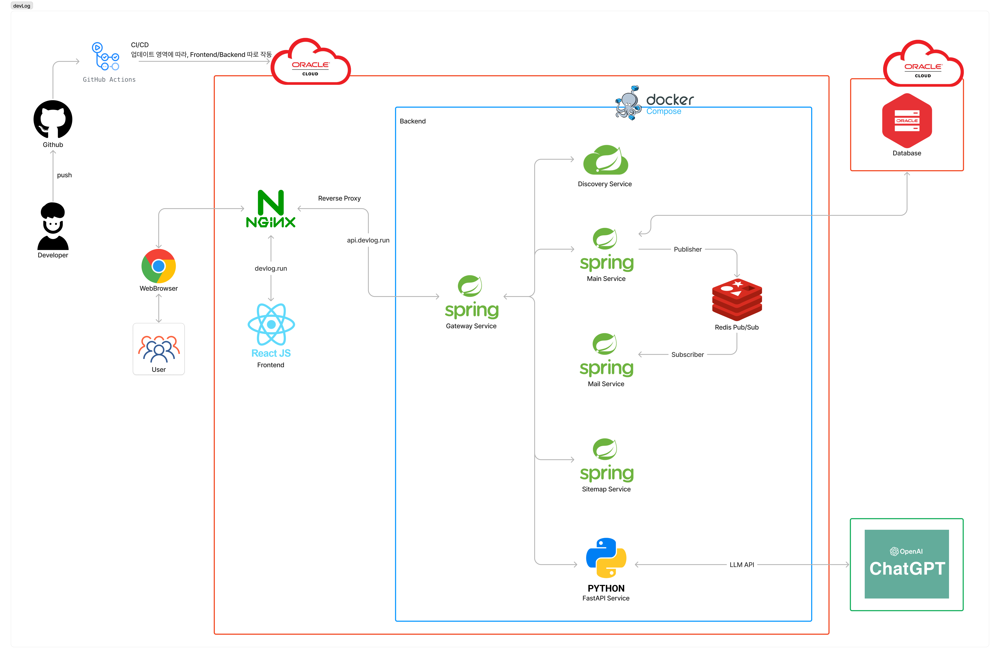
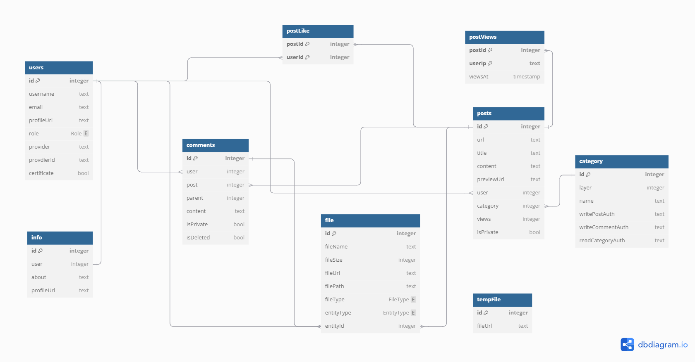
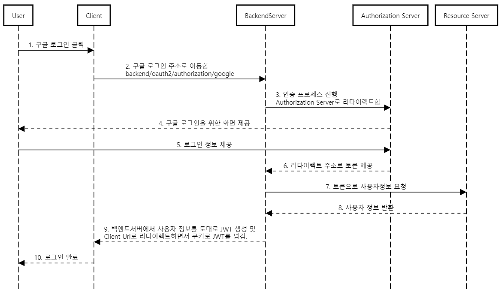
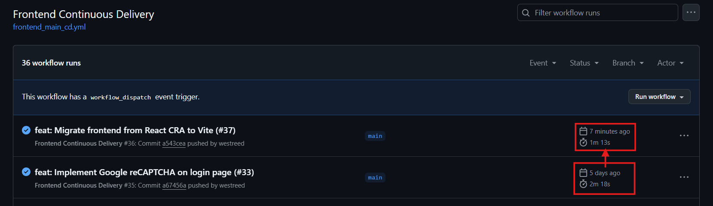

# Devlog

개인 기술 블로그 개발. 
서버는 Oracle Cloud Free Tier의 VM (VM.Standard.A1.Flex)을 활용하여 구축하였습니다.

## Tech Stack

  <table>
    <thead>
    <tr>
      <th>Frontend</th>
      <th>Backend</th>
      <th>Database</th>
      <th>DevOps</th>
    </tr>
    </thead>
    <tbody>
      <tr>
        <td valign="top">
        Next.js 
        Recoil
        </td>
        <td valign="top">
        SpringBoot 
        SpringCloud (MSA) 
        SpringJPA 
        SpringSecurity 
        FastAPI
        </td>
        <td valign="top">
        MySQL (Local) 
        Oracle (Product) 
        Redis
        </td>
        <td valign="top">
        GitHub Actions 
        Nginx 
        Docker (docker-compose) 
        Oracle Cloud
        </td>
      </tr>
    </tbody>
  </table>

## Project

웹서비스에서는 제대로 완성해본 프로젝트가 없어서 한번 도전해보고자 했습니다. 수익을 내고자 하는 프로젝트도 아니고, 기본기의 완성을 위한 목적이었기 때문에 `개인 블로그 (기술 블로그)`를 주제로 삼았습니다. 추가적으로 `LLM AI`를 활용하여 블로그에 적절히 기능을 넣어보는 시도도 해볼 생각입니다.

### 시스템 아키텍처

### WAS 아키텍처

API 게이트웨이 패턴(Spring Cloud Gateway)을 적용했습니다.

LLM 서비스는 Langchain이나 여러 AI 모델을 활용하기 좋은 Python 서버로 결정하게 되었는데, `승인된 유저`만 LLM 서비스를 호출할 수 있게 하려면 JWT 검증이 필요하고 유저데이터 접근도 필요했습니다.

그래서 다양한 언어의 서버를 사용할 수 있는 API 게이트웨이 패턴, MSA (Micro Service Architecture)를 적용하게 되었습니다. Eureka로 서버들을 관리하고, Gateway 서버에서 전처리로 JWT를 검증하고 적절한 서버로 라우팅해줄 수 있게 되어 가지고 있던 문제들을 해결하게 되었습니다.

### E-R 다이어그램

### OAuth 2.0 로그인 구현

Frontend는 React, Backend는 Spring을 사용하여 웹서비스를 만들고 있다보니, OAuth 2.0 로그인 구현에 어려움이 있었습니다.

1. Frontend에서 OAuth 로그인을 처리하면, 구글의 경우 `google-client-id`, `google-client-secret`과 같은 환경변수를 프론트에서 관리해야 합니다.
2. Backend에서 OAuth 로그인을 처리하면, `Resource Server`로부터 받은 유저 정보를 기반으로 JWT를 발급할 수 있지만 프론트에 로그인이 완료되었음을 알리기 위한 방법이 필요합니다.
   1번 방법은 실제로 관련 라이브러리도 많이 존재했지만, 프론트에서 관리하는 것은 불안하다고 생각하여 2번 방법을 선택하게 되었습니다. 그렇다면, 프론트에서 로그인이 완료되었음을 어떻게 알릴 수 있을지 고민을 하게 되었습니다.

결론적으로, 백엔드 서버에서 로그인이 완료되었을 때 작동하는 `SuccessHandler`에서 set-cookie로 JWT를 함께 실어서 Redirect하는 방식으로 구현할 수 있었습니다. 이때, Redirect하는 주소는 프론트에서 로그인에 성공했음을 명확히 알 수 있도록 별도의 `callback` Url로 설정하였습니다.

### Redis Pub/Sub

Redis를 활용하여 Pub/Sub를 구현하였습니다. 메일서버와의 비동기 연결을 위해 사용했고, 메시지 전달 여부가 크게 중요하지 않았기 때문에 Kafka나 RabbitMQ보다는 Redis를 선택하게 되었습니다.

### Frontend Build

프로젝트가 점점 커짐에 따라, 개발서버를 로드하는 것도 느리고, 빌드타임도 빠르게 느려졌습니다. (현재는 약 2분) 아는 건 많이 없지만, 유튜브를 보면서 많이 들었던 건 `Svelte`, `Vite`, `Next.js` 정도 였습니다. 그래서 현재 저의 상황에서 무엇이 가장 좋을지 고민해봤습니다.

우선, 조사를 조금 해본 결과 `Svelte`, `Next.js`는 `React.js`와 같이 애플리케이션을 개발하기 위한 `프레임워크`입니다. 그래서 React로 작성한 프로젝트를 Svelte나 Next.js로 마이그레이션하기에는 어려움이 많고, 저는 빌드타임만 개선하기를 원했기에 선택지에서 지웠습니다.

결국, 마지막으로 남은 `Vite`가 저의 최종 선택지였는데요. 결과적으로도 현재 가장 빠른 빌드타임을 보여주는 `esbuild`를 기반으로 하고 있어서 속도 개선 측면에서도 매우 좋았습니다. 최종적으로 Vite를 도입해서 가지고 있던 문제들을 개선하게 되었고, 배포 파이프라인에서의 빌드타임이 2분 18초에서 1분 13초로 단축되었습니다.

